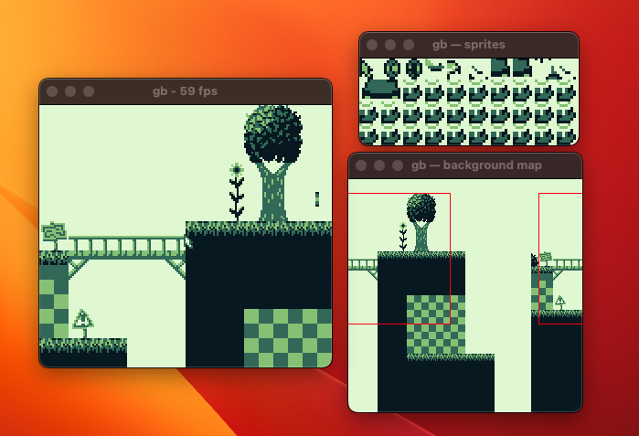

# gb

A work-in-progress Game Boy emulator written as a learning exercise.

<p align="center">
  
</p>

<p align="center">
  
</p>

## Current status

* Passes Blargg's cpu_instrs, instr_timing, and mem_timing tests
* Passes many tests from the [Mooneye test suite](https://github.com/Gekkio/mooneye-test-suite)
* Configurable colour palette and controls
* Controller input (tested with the 8BitDo Zero 2)
* Debugging features such as CPU tracing and VRAM viewers

## TODO

* Implement the window layer
* Implement sound

## Installation

Ensure that [SDL2](https://wiki.libsdl.org/SDL2/) is installed and run `make`
from the [src](src) directory.

## Usage

```
./gb <rom>
```

## Controls

| Key                                                                      | Action                   |
|--------------------------------------------------------------------------|--------------------------|
| <kbd>z</kbd>                                                             | B                        |
| <kbd>x</kbd>                                                             | A                        |
| <kbd>return</kbd>                                                        | Select                   |
| <kbd>backspace</kbd>                                                     | Start                    |
| <kbd>&#8592;</kbd><kbd>&#8593;</kbd><kbd>&#8594;</kbd><kbd>&#8595;</kbd> | Joypad                   |
| <kbd>p</kbd>                                                             | Cycle palette            |
| <kbd>[</kbd><kbd>]</kbd>                                                 | Resize window            |
| <kbd>b</kbd>                                                             | Toggle background viewer |
| <kbd>s</kbd>                                                             | Toggle sprite viewer     |

See [src/config.h](src/config.h) for the full list of controls.

## Tests

### Running the tests

The Mooneye test suite is used to keep track of progress.  Currently Emacs is
required to run the tests automatically.  To run the test suite:

1. Visit [test/test.el](test/test.el) in Emacs and `M-x eval-buffer`
2. `M-x gb-download-test-suites` to download the tests
3. `M-x gb-test-mooneye` to run the tests
4. A buffer will open with the test results
   * Press `RET` on a test to rerun it with the GUI
   * Press `s` on a test to view its source code

### Test results

```
49 / 66 tests passed

mooneye/acceptance/add_sp_e_timing.gb                        PASS
mooneye/acceptance/bits/mem_oam.gb                           PASS
mooneye/acceptance/bits/reg_f.gb                             PASS
mooneye/acceptance/bits/unused_hwio-GS.gb                    FAIL
mooneye/acceptance/boot_div-dmgABCmgb.gb                     FAIL
mooneye/acceptance/boot_hwio-dmgABCmgb.gb                    FAIL
mooneye/acceptance/boot_regs-dmgABC.gb                       PASS
mooneye/acceptance/call_cc_timing.gb                         PASS
mooneye/acceptance/call_cc_timing2.gb                        PASS
mooneye/acceptance/call_timing.gb                            PASS
mooneye/acceptance/call_timing2.gb                           PASS
mooneye/acceptance/di_timing-GS.gb                           PASS
mooneye/acceptance/div_timing.gb                             PASS
mooneye/acceptance/ei_sequence.gb                            PASS
mooneye/acceptance/ei_timing.gb                              PASS
mooneye/acceptance/halt_ime0_ei.gb                           PASS
mooneye/acceptance/halt_ime0_nointr_timing.gb                PASS
mooneye/acceptance/halt_ime1_timing.gb                       PASS
mooneye/acceptance/halt_ime1_timing2-GS.gb                   PASS
mooneye/acceptance/if_ie_registers.gb                        PASS
mooneye/acceptance/instr/daa.gb                              PASS
mooneye/acceptance/interrupts/ie_push.gb                     FAIL
mooneye/acceptance/intr_timing.gb                            PASS
mooneye/acceptance/jp_cc_timing.gb                           PASS
mooneye/acceptance/jp_timing.gb                              PASS
mooneye/acceptance/ld_hl_sp_e_timing.gb                      PASS
mooneye/acceptance/oam_dma/basic.gb                          PASS
mooneye/acceptance/oam_dma/reg_read.gb                       PASS
mooneye/acceptance/oam_dma/sources-GS.gb                     CRASH
mooneye/acceptance/oam_dma_restart.gb                        PASS
mooneye/acceptance/oam_dma_start.gb                          PASS
mooneye/acceptance/oam_dma_timing.gb                         PASS
mooneye/acceptance/pop_timing.gb                             PASS
mooneye/acceptance/ppu/hblank_ly_scx_timing-GS.gb            FAIL
mooneye/acceptance/ppu/intr_1_2_timing-GS.gb                 PASS
mooneye/acceptance/ppu/intr_2_0_timing.gb                    FAIL
mooneye/acceptance/ppu/intr_2_mode0_timing.gb                FAIL
mooneye/acceptance/ppu/intr_2_mode0_timing_sprites.gb        FAIL
mooneye/acceptance/ppu/intr_2_mode3_timing.gb                FAIL
mooneye/acceptance/ppu/intr_2_oam_ok_timing.gb               CRASH
mooneye/acceptance/ppu/lcdon_timing-GS.gb                    FAIL
mooneye/acceptance/ppu/lcdon_write_timing-GS.gb              FAIL
mooneye/acceptance/ppu/stat_irq_blocking.gb                  PASS
mooneye/acceptance/ppu/stat_lyc_onoff.gb                     FAIL
mooneye/acceptance/ppu/vblank_stat_intr-GS.gb                FAIL
mooneye/acceptance/push_timing.gb                            PASS
mooneye/acceptance/rapid_di_ei.gb                            PASS
mooneye/acceptance/ret_cc_timing.gb                          PASS
mooneye/acceptance/ret_timing.gb                             PASS
mooneye/acceptance/reti_intr_timing.gb                       FAIL
mooneye/acceptance/reti_timing.gb                            PASS
mooneye/acceptance/rst_timing.gb                             PASS
mooneye/acceptance/serial/boot_sclk_align-dmgABCmgb.gb       FAIL
mooneye/acceptance/timer/div_write.gb                        PASS
mooneye/acceptance/timer/rapid_toggle.gb                     PASS
mooneye/acceptance/timer/tim00.gb                            PASS
mooneye/acceptance/timer/tim00_div_trigger.gb                PASS
mooneye/acceptance/timer/tim01.gb                            PASS
mooneye/acceptance/timer/tim01_div_trigger.gb                PASS
mooneye/acceptance/timer/tim10.gb                            PASS
mooneye/acceptance/timer/tim10_div_trigger.gb                PASS
mooneye/acceptance/timer/tim11.gb                            PASS
mooneye/acceptance/timer/tim11_div_trigger.gb                PASS
mooneye/acceptance/timer/tima_reload.gb                      PASS
mooneye/acceptance/timer/tima_write_reloading.gb             PASS
mooneye/acceptance/timer/tma_write_reloading.gb              PASS
```
